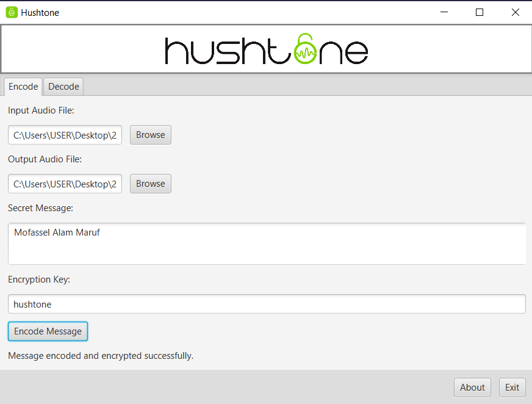
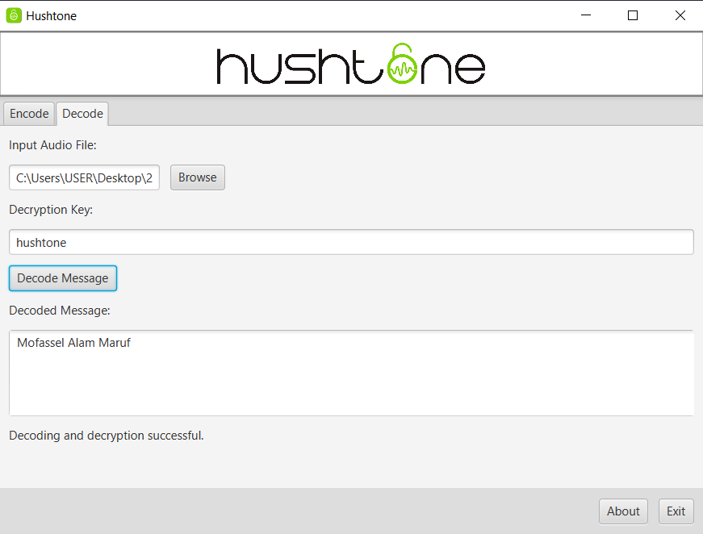

# 🛡️ Hushtone - Secure Audio Steganography  

  

Hushtone is a professional audio steganography tool that lets you securely hide and retrieve messages within 16‑bit PCM WAV audio files. It uses a raw implementation of AES‑128 encryption (with CBC mode and PKCS#5 padding) to ensure maximum confidentiality.

---

## 📌 Features  
✔️ Hide secret messages inside audio files  
✔️ Extract hidden messages with decryption  
✔️ AES-128 encryption with PKCS#5 padding (CBC mode)  
✔️ User-friendly graphical interface (JavaFX)   

---
## 🛠️ Requirements

- **WAV Files:** The input audio file must be a 16‑bit PCM WAV file.
- **Java 17+ Runtime:** Your system must have a Java Runtime Environment.  
  (Alternatively, use the self-contained jar provided.)

---

## 🖼️ Screenshots  

### 🔹 Encode Message  
  

### 🔹 Decode Message  
  

---

## 🚀 How to Run (Jar Only)

1. **Download the Jar File:**  
   Get the latest release of Hushtone from the [Releases](https://github.com/YourRepo/Hushtone/releases) page.

2. **Run the Application:**  
   Open a terminal (or Command Prompt) and execute:
   ```sh
   java --module-path "C:\javafx-sdk-22.0.1\lib" --add-modules javafx.controls,javafx.fxml -jar Hushtone.jar
   ---
   


## 🎯 Usage  

1️⃣ **Encoding**  
   - Select an audio file (`.wav` format recommended).  
   - Enter the secret message.  
   - Encrypt and save the modified audio file.  

2️⃣ **Decoding**  
   - Load the encoded audio file.  
   - Enter the decryption key (AES-128).  
   - Retrieve the hidden message.  

---

## ⚙️ Technologies Used  

- **Java 17+**  
- **JavaFX** (GUI framework)  
- **AES-128 Encryption** (PKCS#5, CBC mode)  

---
## 👤 Developer  

👨‍💻 **Mofassel Alam Maruf**  
📚 B.Sc. in Software Engineering, IIT, NSTU  
📧 [mofasselalammaruf@gmail.com](mailto:mofasselalammaruf@gmail.com)  
🌐 [GitHub Profile](https://github.com/10Maruf)  

---

## 📜 License  
📝 This project is licensed under the **MIT License** – feel free to use, modify, and distribute it.  

---


🔒 **"Secure Your Messages, One Soundwave at a Time!"**  
